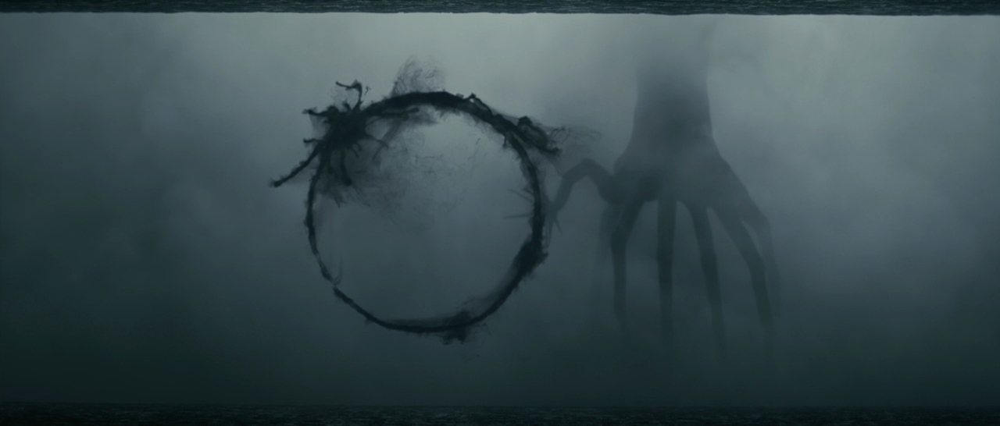

I had the absolute pleasure of watching a showing of *Arrival (2016, dir. Denis Villeneuve)* at the Palm Theatre in downtown SLO a few nights ago.

Dare I say, Masterpiece. Coming from a person who dislikes space and alien movies.

At first glance, I was under the impression I was walking into an overdone film trope of aliens' first arrival to Earth. But then, why would this be one of the highest acclaimed movies to abdicate my watchlist?

*Major spoilers below, so please go watch the film if you have not already!*

At its heart, *Arrival* is a film about language and the importance of communication. As English speakers, the majority of US individuals are raised learning to speak before writing. We hear the word *read*, then learn what it means to read, and then are able to spell it *r-e-a-d*. In *Arrival*, the aliens, referred to as *heptapods* (originating from the Greek — *hepta* for seven and *pod* for legs), communicate a different manner. 

They seem to make these very heavy bass reverberation sounds, none of which Louise (splendidly played by actress Amy Adams), an educator in linguistics, could recognize any pattern of. Louise, whose daughter develops a disease at the beginning of her film, is brought on to a military base camp translate the alien sounds. Eventually, upon making contact, the aliens begin depicting via symbolic communication; their words were represented by circular-esque icons, created from ink splotches sprayed out of their tentacles and seperated by a barrier.

Theoretical Physicist Ian (played by Jeremy Renner) finds a mathematical way to connect these symbols. He develops an algorithm to detect the intricacies of the splotches and maps them to words. Yet, there is still little correlation between the symbols and the sounds produced simultaneously.

Quick tangent, author Cal Newport talked briefly [this week](https://open.spotify.com/episode/1D17BIX1uhc7UaVPBU0uV5?si=75877814e07f4931) about how his theoretical computer science background had heavily influenced his ability to write and speak clearly. The ability to perform mathematical proofs had been integral to his success as a writer. He has been able to evolve his writing into a formulaic process, derived from his doctrinal background. Enlightening.

The film twists when Amy is taken up to the giant orb shuttle and communicates one—on—one with the heptapods, barrier omitted. She is chosen to be given their power. It is not that they were here to attack. It was not their intention to act as a weapon, as all the nations thought. The heptapods arrived as a vessel to transmit a gift. This is when Louise shouts "*WHO IS THIS CHILD?*", after being plagued by visions of her future daughter, and the immense soundtrack crescendos — upon realizing the storyline, I burst into tears. Their language was **time**, and she was given the gift of seeing her future, past, and present simultaneously. In return, the heptapods asked help from humanity in the future to come.

Intertwining with a non-linear sequence and orchestral score, Louise narrates
> Despite knowing the journey... and where it leads... I embrace it. And I welcome every moment of it.

Louise accepts the future and embraces the journey, and chooses to have her daughter Hannah in light the future. Regardless of how we can perceive time and understanding, she chooses not to change anything; she accepts the hardship with the evanescent beauty. 

This contrasts Kierkegaard's idea of
> Life can only be understood backwards; but it must be lived forwards.

Regardless of the existential burden the future and impending weight of uncertainty, Kierkegaard continues living in spite of it. In a sort of juxtaposition, I choose to view Louise's situation as an almost harder leap — to continue her path in spite of the *certainty*.

Linguistic communication is not only from our mouths, our words, our texts or phrases, it originates from our perception. What may seem to us like a collection of disjointed circles is the entire language of the heptapods. 

The future is and always will be unknown, and existence continues in spite of it. I believe *Arrival* was a nod to deterministic universes, one in which the entire course of a life is preplanned. She uses her future knowledge to fully save the universe (or maybe it already saved...) Despite all of that and her new perception on life, she embraces her future with a focus on the beauty and wholesome moments, while also enduring the harder ones. 

A film I walked into questioning its relevance I left with answers I never would've expected.
