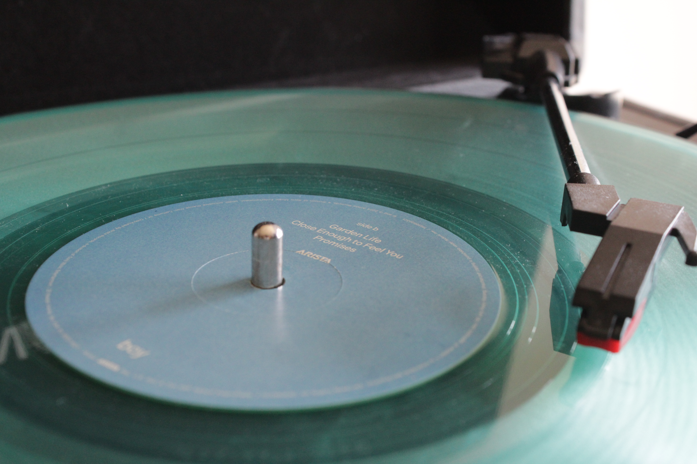

## New is *not* Always Better
One show I grew up watching (and still love to this day) is *How I Met Your Mother*. One character, the eccentric and slick Barney Stinson, would always emphasize repeated catch phrases and rules. He often would say "I only have one rule", and then say some far-out saying that often was illogical or a hot-take.

In one episode, he says

> Ted, I am going to give you four words to live by
>
> ==**New is always better**==

This was used to arguing the destruction of a famous landmark in the show, but he applies it when stating that the new *Star Wars* films were better than the old and that Guns and Roses' *Chinese Democracy* was better than _Appetite for Destruction_.

As our modern technology continues to progress, I often find that this extreme generalization seems to be a misconception. With the computing power present in our pockets and the plethora of entertainment, media, ad boards, and mass production present in our world, we seem to have lost the ideas of mindful and deliberate consumption. Some of the choices of device use I have made recently have helped me reject this modernity and embrace intentionality. This idea is called *Slow Technology*, and is an idea popularized by many digital ethicists. There is a wonderful podcast episode on the embrace of Slow Technology [here](https://open.spotify.com/episode/214eGYF4C8NShDshokGBpZ?si=d945b6c5a5b84a48) which I often go back to for a kick of inspiration. 
## Appeal of Blu-Ray DVDs
Recently, as recent as spring 2026, I bought a blu-ray player. To me, this felt like one of my first absurd purchases. Why, in the age of streaming and mass-media consumption, would one purchase a blu-ray player? 

In my opinion, there are obvious benefits. Firstly, the concept of owning physical media is one that is unparalleled. People have been deemed "collectors" for centuries. In recent years, it seems collectors of the dying form of Blu-Ray seems to make owning them recursively more valuable, 

The ability of holding an entire cinematic universe in your hand with its reflective neon blue case staring back at you an elevated, evanescent feeling. The act of inserting the disc into the player, the patience exercised during the duration of handpicked trailers of movies from the same year, and the physical selection of a **PLAY** option seems to keep me more grounded. 

On a deeper level, there is a sense of termination of the movie. Films have a start, the trailers run and then you watch it, and it the credits roll up. There is a fixed start and end point of the film; there is no "starting in 30s" follow-up content as would be present in streaming services. 

## Vintage and Vinyl 
When I first started collecting Vinyl records in 2022, it was out of response for an aesthete purpose — I wanted to be one of those superficial vinyl collectors that valued the older audio form for its retro and vintage look over its form and function. Vinyl records offer a more unique modality of listening to music: grooves and lines engraved on a 12 inch discus would produce some of the highest quality tones possible as it spins at around 0.75 revolutions per second. 

As I transition towards embracing more ancient technologies, I began to realize the obscured value of records that many fail to recognize. The strength a record offers is in its invariant and consistent sequence of steps. You must pull the record out of its sleeve, place it on the turntable, turn it on and set the needle at the very edge, and start it. What follows is on untouched retirement from managing the record; all that remains is to enjoy the record without a bombardment of distraction. There is a preordained order in which the album is ordered, leaving you bound to the artist's designated tracklist. 

Compare this to streaming services such as Spotify (not to be degrading, I am a frequent Spotify user). Vinyl does not give you the option of fade-in/fade-out transitions, there is no skip song, no ad break, and occasionally, little blips or imperfections on the record that make you appreciate the nostalgic format so much more. The other action taken with records that is absent in streaming services is the need to stand up and flip over a record for larger or deluxe albums, which became increasingly popular in the 70s and 80s, still remain common today. These would often have engraved 

With this thought, I want to recollect a treasured reminder of these primitive media days that the world once used to be in. In Tom Petty's deluxe album *Full Moon Fever*, Petty included an addendum that has stuck with me since childhood. In the last 30 seconds of the hit track *Running Down A Dream*, the final song of the album, he added the following[^1],

> Hello CD listeners. We have come to the point in this album where those listening on cassette or records will have to stand up or sit down and turn over the record or tape. In fairness to those listeners, we will now take a few seconds before we begin side two. Thank you. Here's side two.

Growing up with this song on loop through streaming services, I would always get a bit peeved, just wanting to hear the next song on my playlist. As I have matured though, I have come to appreciate this message. Petty stays considerate of those listening on all forms of media, and remains true today. While CD listeners would have no action to take, vinyl listeners have to take the beautiful action of interacting with their record and switching it to another side. It is a purposeful yet ornamental album of adding a personalized touch to the record.

## Friction from the Flip phone

[^1]: https://youtu.be/QrNdBU_gb7o?si=zuJEa04OXOEyZGEx
